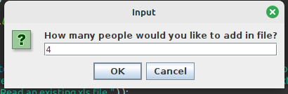
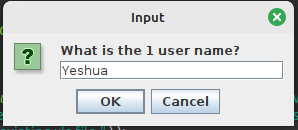
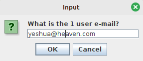
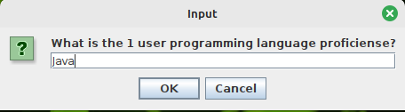
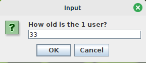
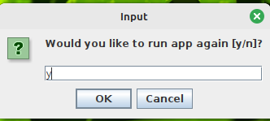
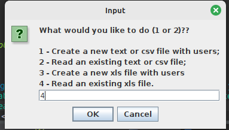
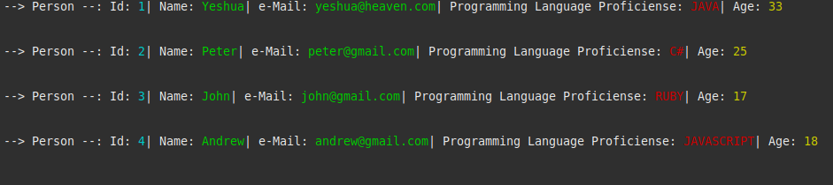

<h1 align="center">Files Manager</h1>

## 📖️ About
<p>This project aims to create and read many different files extensions (txt, csv and xls). This app allows you to add fixed user information, such as: name, email, programming language in which you are proficient, age and each user has an ID generated on the spot within the list of created users.</p>

## 🤝️ Business rules
<p>The software allows the chose of witch extension you want to create and save the file "myUsersInfos" between txt, csv or xls with some datas about users like: (id generate automatcaly), name, e-mail, prigramming language proficiense and age.</p>


<br/>
<p align="center">Practical examples below</p>
<hr/>

<h3 align="center">First part of Files Manager program interaction</h3>


<br/>

<h3 align="center">Second part of Files Manager program interaction</h3>


<br/>

<h3 align="center">Third part of Files Manager program interaction</h3>


<br/>

<h3 align="center">Fourth part of Files Manager program interaction</h3>


<br/>

<h3 align="center">Fifth part of Files Manager program interaction</h3>


<br/>

<h3 align="center">Sixth part of Files Manager program interaction</h3>


<br/>

<h3 align="center">Seventh part of Files Manager program interaction</h3>


<br/>

<h3 align="center">Eighth part of Files Manager program interaction</h3>


<br/>

<h3 align="center">Ninth part of Files Manager program interaction</h3>


<br/>
<hr/>

## 🔨 Tools

- [OS - Linux Mint](https://www.linuxmint.com/download.php)
- [Java 22.ea.26-open across sdkman](https://sdkman.io/install)
- [Eclipse](https://eclipseide.org/)
- [Apache Poi - Maven](https://mvnrepository.com/artifact/org.apache.poi/poi/5.0.0)
- [Commons Codec - Maven](https://mvnrepository.com/artifact/commons-codec/commons-codec/1.16.0)
- [Commons Collections4](https://mvnrepository.com/artifact/org.apache.commons/commons-collections4/4.4)
- [Commons Math3](https://mvnrepository.com/artifact/org.apache.commons/commons-math3/3.6.1)
- [slf4j](https://mvnrepository.com/artifact/org.slf4j/slf4j-api/2.0.6)
- [Sparse Bit Set](https://mvnrepository.com/artifact/com.zaxxer/SparseBitSet/1.2)

<br />

```bash
	#Clone this project
    git clone https://github.com/giovanni0800/java-calculator.git
```

<br />
<hr />

## 📚 Libs
- javax.swing.JOptionPane;
- java.util.Scanner;
- java.io.File;
- java.io.FileWriter;
- java.io.IOException;
- java.util.ArrayList;
- java.util.List;
- java.io.FileOutputStream;
- java.io.FileInputStream;
- org.apache.poi.hssf.usermodel.HSSFSheet;
- org.apache.poi.hssf.usermodel.HSSFWorkbook;
- org.apache.poi.ss.usermodel.Cell;
- org.apache.poi.ss.usermodel.Row;
- java.io.FileNotFoundException;
- java.util.Iterator.

<br />

## 📔️ License
This Project is under the MIT license. See the file LICENSE
for more details